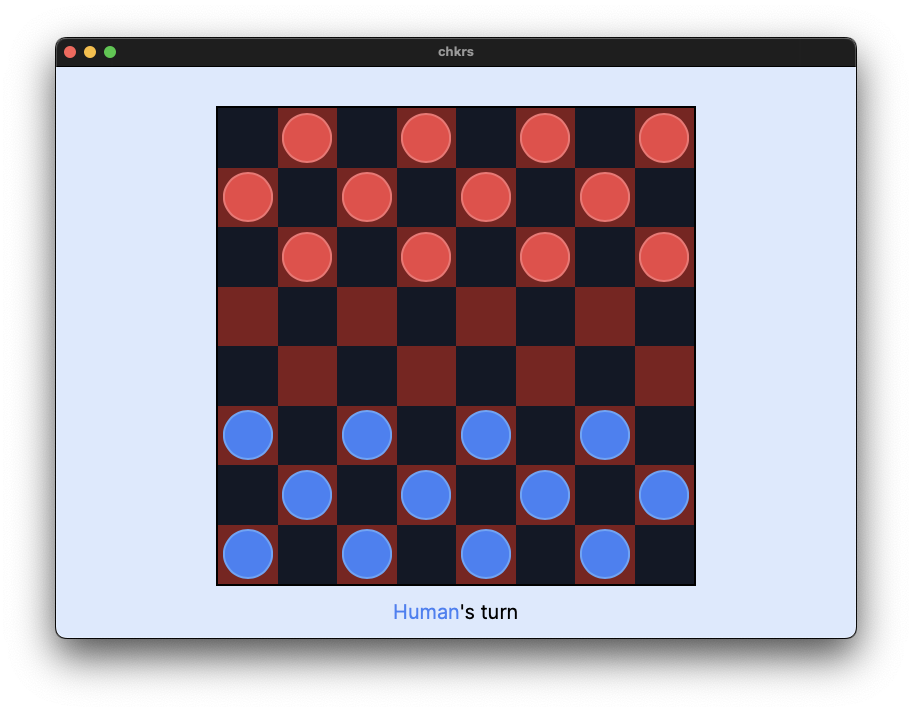

# chkrs



A toy project to demonstrate Typescript/Rust interop using Tauri. It's a simple checkers game with a CPU opponent that uses Monte Carlo Tree Search to make decisions.

## Todo
- [ ] Write rigorous tests for the game logic
- [ ] Use a bitboard approach for game state representation (the rigorous tests will help with this)
- [ ] Add multithreading to the MCTS algorithm (see [dashmap](https://github.com/xacrimon/dashmap))
- [ ] Visual overhaul (animations, etc.)

## Development
Tests:
```bash
cd src-tauri
cargo test
```

Benchmarks:
```bash
cd src-tauri
cargo bench
# open target/criterion/report/index.html
```

Running the app:
```bash
cargo tauri dev
```


## Building
```bash
cargo tauri build
```